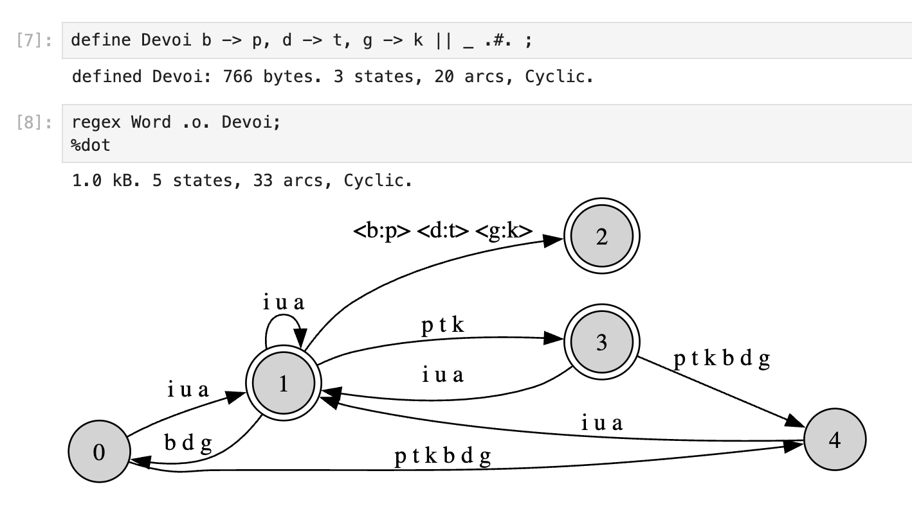

# REPLs in Jupyter notebooks for FST languages
The languages and interpreters in the FST family (xfst, foma, hfst-xfst, and sfst) are used with command line interfaces in the form of read-eval-print loops. Finite state machines representing regular sets of strings and regular relations between strings are defined using straight-line programs. The syntax, semantics, and use of the language is described in Beesley and Karttunen's *Finite State Morphology* (CSLI/Chicago).
For installation and documentation of Måns Hulden's Foma, see [fomafst.github.io](https://fomafst.github.io/).

This repository provides REPL functionality in Jupyter notebooks, in two forms.  `Foma_kernel` is a Jupyter kernal that provides foma and markdown cells.  Alternatively, `foma_notebook.py` allows foma to be incorporated into code cells in a Python notebook, using cell magic. In both cases, a single foma process is maintained, with the context of definitions and stack preserved across cells.

Both versions allow for graphical display of machines using dot diagrams rendered inline. Below is an example using the Foma kernel.



Currently foma is supported.

For documentation and installation for the foma kernel, see `foma_kernel/README.md`. For use of `foma_notebook.py` in a notebook, see the demo notebook. 

## Demos

| Notebook             |                                          |
| -------------------- | ---------------------------------------- |
| `foma_python.ipynb`  | Foma in code cells of a Python notebook  |
| `foma-kernel.ipynb`  | Foma kernel with Foma code cells         |


## Repository structure
```
├── foma_kernel
│   ├── foma_kernel
│   │   ├── __init__.py
│   │   ├── __main__.py
│   │   ├── kernel.py
│   │   ├── kernelspec
│   │   │   └── kernel.json
│   │   └── session.py
│   ├── foma-kernel.ipynb
│   ├── pyproject.toml
│   ├── README.md
├── foma_notebook.py
├── foma_python.ipynb
├── foma-kernel.ipynb
├── img
│   ├── Devoi.png
│   └── Launcher.png
└── README.md

```

## Development 

Design and implementation were carried out by Mats Rooth with extensive assistance from ChatGPT (OpenAI, GPT-5.5) through an iterative design, implementation, and code-review process.

